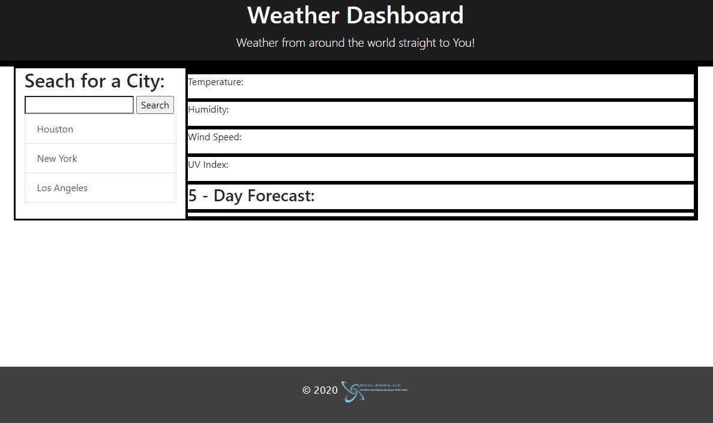
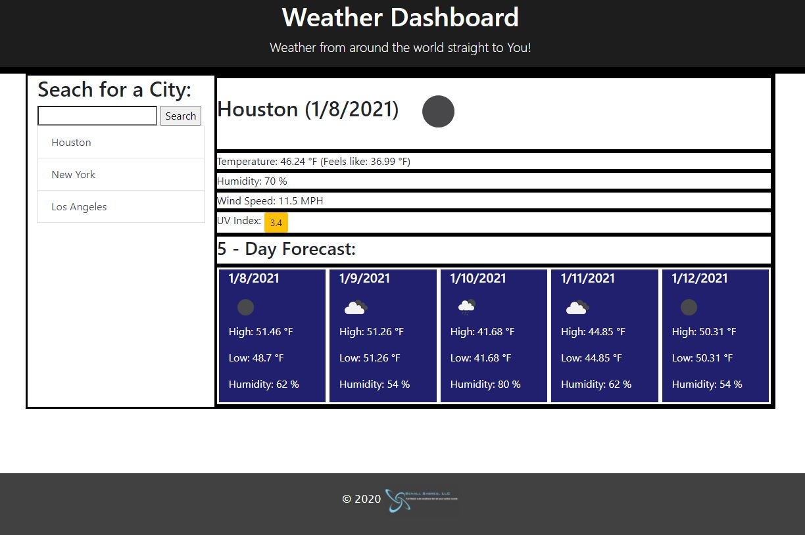
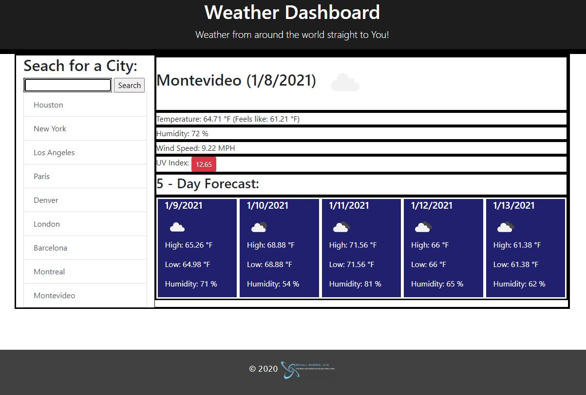

# Weather-App

Do you work outside? Maybe just a long commute to work? Are you a world traveller? Do you have loved ones that live in a different city/state/country than you? Or maybe you are just a very curious person? Knowing what the weather will be like for all of the above circumstances can be a very good thing. How to prepare before leaving the house, or what to pack before getting on a plane. Checking in on your loved ones to make sure if their upcoming weather will be ok. Is your favorite place Barcelona or Breckenridge and you like to see what the weather is like in those places just to make you feel better when the weather in your town is miserable?

Having a good weather app is a luxury that is made available to us through the miracle of the internet and interconnectivity. Whereas before, the only way to know what to expect weather-wise was to watch television or have a Farmer's Almanac, now we have the ability to find this information with the click of a button.

## The Llanes Weather App

Find out the current temperature, humidity, wind speed, UV index, and the 5-Day forecast for virtually any city in the world. Simply type in the name of the city in the "Search" box and you will instantly receive the above mentioned information for that city. The site will also save the cities you have searched for so you can quickly refer back to them.

## Screenshots

See the following SCREENSHOTS to get an idea of what the Llanes Weather App looks like:

You can view and use the Weather app here:
https://mrllanes.github.io/Weather-App/

For more information, please contact Michael Llanes via e-mail: llanesm@gmail.com
